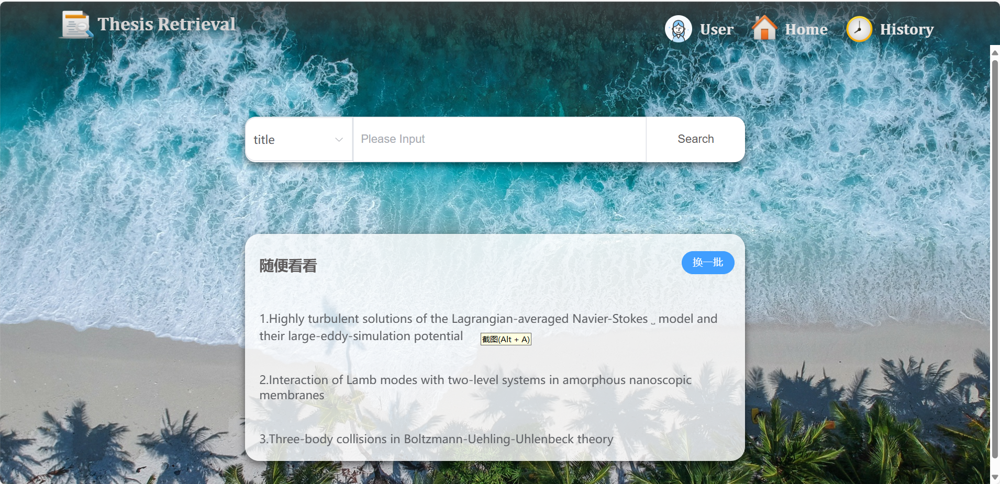
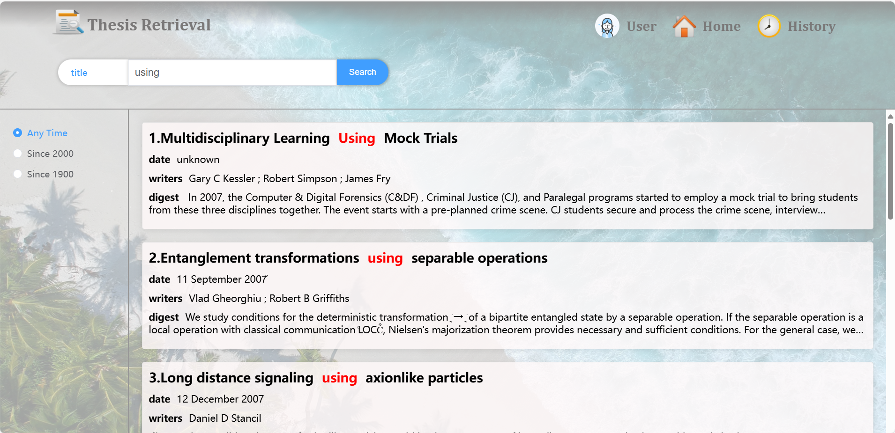
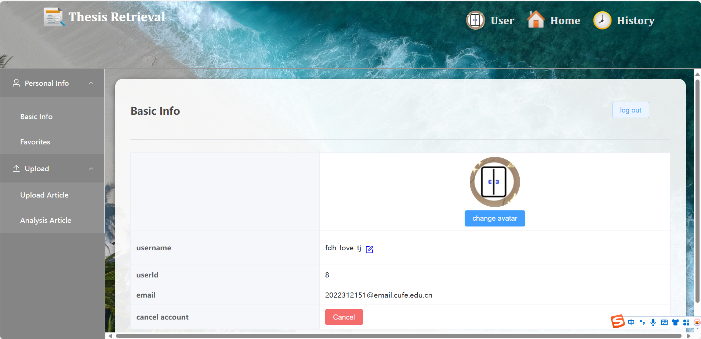
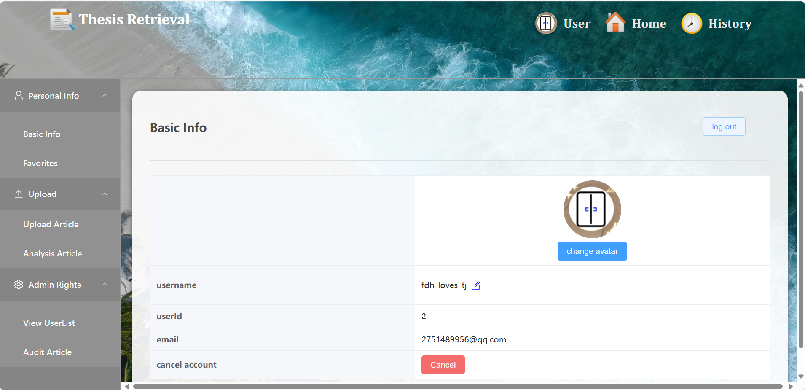

# Information Retrieval System

In this project, we utilize [Grobid](https://github.com/kermitt2/grobid) to extract information from the original PDF files of articles.

We then use [Lucene](https://lucene.apache.org/) to index the extracted information.

The backend is built using [Spring Boot](https://spring.io/projects/spring-boot), while the frontend is developed with [Vue.js](https://cn.vuejs.org/).

Due to the large size of the PDF files, we are only providing the source code here. However, you can find the data source and the data processing procedure in `introduction.pdf`. Additionally, all system functionalities are also documented in `introduction.pdf`.

## System Functionalities Overview

Our system is divided into five main components: Home Page, Search Results Page, Details Page, User Information Page, and Admin Information Page.

Regardless of which page you're on, you can navigate using the top buttons:
- **User**: Jump to the User Information Page if you are logged in. Otherwise, you can create a new account using your email or log in.
- **Home**: Return to the Home Page.
- **History**: View the usage records.

To help you better understand the functionalities of our system, here are some screenshots of each component:

### Home Page

### Search Results Page

### Details Page

### User Information Page

### Admin Information Page

